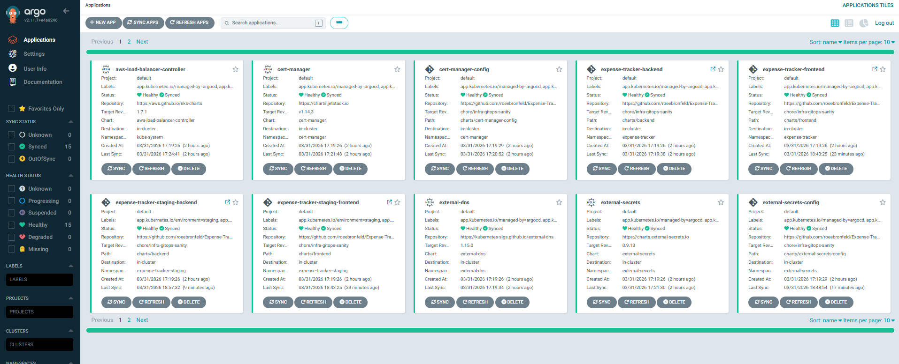
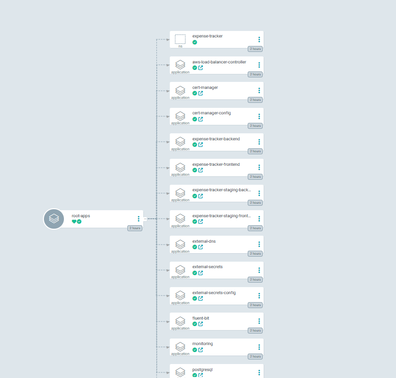

# Expense Tracker GitOps

ArgoCD app-of-apps repository for the Expense Tracker platform.

This repository is the declarative source of truth for what should run inside the Kubernetes cluster: platform services, workload applications, Helm values, sync order, and environment-specific production configuration.

## Visual Overview

### ArgoCD Application Health



### App-of-Apps Topology



### Sync Demo

[Watch the ArgoCD sync walkthrough](docs/assets/argocd-sync-demo.mp4)

## What This Repo Does

- Defines the `root-apps` ArgoCD application
- Renders child applications through an app-of-apps Helm chart
- Deploys platform services such as:
  - AWS Load Balancer Controller
  - ExternalDNS
  - External Secrets
  - cert-manager
  - Fluent Bit
  - kube-prometheus-stack
- Deploys workload services such as:
  - frontend
  - backend
  - PostgreSQL
- Keeps production image tags and ingress values declarative
- Encodes sync waves so dependencies come up in a controlled order

## Repository Structure

```text
Expense-Tracker-gitops/
├── apps/
│   ├── root-application.yaml
│   ├── values.yaml
│   ├── values-prod.yaml
│   └── templates/
│       ├── backend.yaml
│       ├── frontend.yaml
│       ├── monitoring.yaml
│       ├── postgresql.yaml
│       └── platform app templates
├── bootstrap/
│   ├── argocd-values.yaml
│   └── argocd-values-production.yaml
├── charts/
│   ├── backend/
│   ├── frontend/
│   ├── cert-manager-config/
│   └── external-secrets-config/
└── environments/
    └── prod/
        ├── backend-values.yaml
        ├── frontend-values.yaml
        └── grafana-production-values.yaml
```

## App-of-Apps Model

```text
root-apps
  -> platform applications
  -> workload applications
  -> Helm values for production
```

The root application points ArgoCD at `apps/`, which then renders child `Application` resources for everything else in the cluster.

## Production Flow

```text
GitHub Actions updates image tags
  -> commit lands in GitOps repo
  -> ArgoCD detects drift
  -> sync applies Helm values
  -> PreSync migration job runs
  -> backend/frontend converge
```

## Important Design Choices

| Choice | Why It Matters |
| --- | --- |
| App-of-apps | keeps one top-level entry point while preserving clear app boundaries |
| Helm charts for workloads | reusable, versioned, and easier to reason about than raw manifests |
| External Secrets integration | Kubernetes consumes runtime secrets without committing them to Git |
| Migration PreSync job | database migrations run before backend rollout |
| Separate prod values | keeps runtime tuning and ingress config explicit |
| Public-safe repo URLs | public version points to `*-Public` repos, not private remotes |

## What Lives Here vs Elsewhere

| Concern | Repository |
| --- | --- |
| AWS provisioning | `Expense-Tracker-Infra-Public` |
| Application source code | `Expense-Tracker-App-Public` |
| Cluster desired state | this repository |

## Public-Safe Notes

This public repo intentionally contains placeholders instead of account-specific values:

- ECR URLs use `123456789012`
- ops allowlists use `203.0.113.10/32`
- GitHub App values use placeholder IDs
- secrets remain references to External Secrets and Secrets Manager, not committed values

## Working With This Repo

Validate charts:

```bash
helm lint apps -f apps/values-prod.yaml
helm lint charts/backend -f environments/prod/backend-values.yaml
helm lint charts/frontend -f environments/prod/frontend-values.yaml
```

Render the root app:

```bash
helm template root-apps apps -f apps/values-prod.yaml
```

## Related Repositories

- [Expense-Tracker-Infra-Public](https://github.com/roeebronfeld/Expense-Tracker-Infra-Public) bootstraps ArgoCD and provisions the AWS platform
- [Expense-Tracker-App-Public](https://github.com/roeebronfeld/Expense-Tracker-App-Public) produces the application images that this repo deploys
